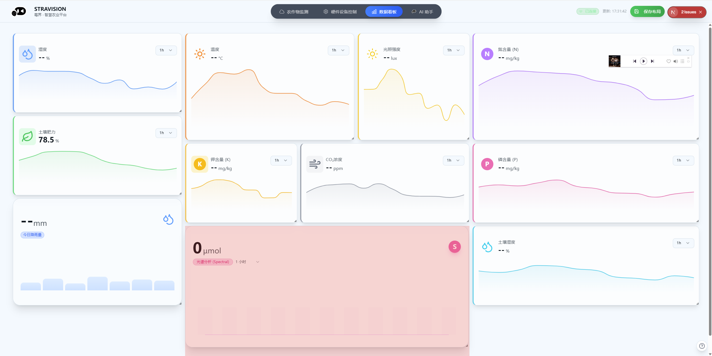
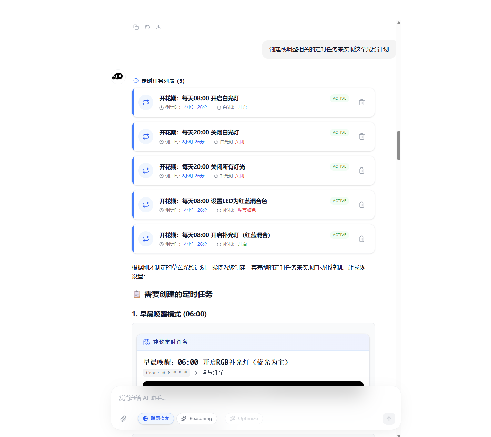

# Stravision 智慧农业物联网平台

官方网站：[https://stravision.cheesestrawberry.top/](https://stravision.cheesestrawberry.top/) 

本项目采用 **MIT 开源许可证**（MIT License）。

---

## 项目简介

Stravision 智慧农业物联网平台是一套面向现代农业生产场景的综合智能管理系统，用于实现农业环境数据采集、设备控制、实时监控、智能分析与辅助决策等功能。

平台通过融合物联网、人工智能、大数据分析等技术，为农业生产者提供可视化监测、智能控制与智能咨询等能力，能够在温室大棚、设施农业基地或农业实验场景中实现高效、无人化、精准种植管理。

Stravision 致力于利用人工智能技术推动农业数字化转型，为全球农业种植者提供智能、高效的解决方案。 

---

## 核心功能与特点

### 智慧感知

平台支持多模态感知能力，包括视觉数据与传感器数据的融合分析，实现对植物状态、环境信息和农业生产情况的全面感知。

### 全栈环境监测

对空气、土壤、光照、温湿度等关键农业环境参数进行实时、持续的数据采集与监控，支持历史趋势分析与实时预警。

### 智能决策引擎

基于动态环境调控算法和智能控制逻辑，平台能够自动管理水、肥、光、气等农业生产要素，实现全天候无人化精准种植。


### AI 农业助手

内置 AI 智能顾问模块，结合大语言模型与 RAG（检索增强生成）技术，为用户提供实时的病害诊断、种植建议和交互式操作指导。用户可以像对话一样与系统互动，直接获取农业技术方案建议。

### 边缘计算支持

平台支持边缘计算节点部署，使得环境监测和实时分析能够在网络条件不稳定的情况下独立运行，提高系统的可靠性与实时性。

### 企业级安全

采用数据加密传输和存储策略，确保农业数据和设备控制指令在网络传输过程中得到有效保护。

### 设备协同与远程控制

支持多种农业设备的联动控制，包括水泵、风机、照明系统等，并支持远程实时操作和自动化任务配置。

---

## 典型应用场景

* 温室大棚环境的实时监测与运行调控
* 农业生产过程自动化控制
* 多终端可视化监控平台部署
* 农业精准种植技术辅助决策
* 农业科研与教学平台构建
* 农业竞赛与技术验证方案实施

---

## 技术架构

Stravision 平台整体采用前后端分离的系统架构，同时结合容器化与现代 Web 技术：

### 前端

基于现代 Web 技术栈实现用户界面，支持桌面端和移动端访问，包括智能控制台、监控面板、数据大屏等可视化模块。 

### 后端

后端服务负责处理数据采集、设备交互、业务逻辑和 AI 推理等功能，为前端提供统一 API 接口支持。

### 数据层

采用高效的数据存储与缓存策略，支持时序数据存储、日志记录和历史数据分析。

### 容器化与部署

平台支持 Docker 化部署，通过标准容器镜像和 Docker Compose 实现快速搭建与可重复部署。

---

## 项目结构说明

```
Stravision-IOT-PlatForm
├─ app/                前端应用代码（Next.js 等）
├─ components/         前端 UI 组件与重用模块
├─ data/               示例数据与静态资源
├─ docs/               项目相关文档与说明
├─ lib/                公共库与通用逻辑组件
├─ models/             数据模型定义
├─ nginx/              Nginx 配置与代理模板
├─ public/             静态资源文件
├─ docker-compose.yml  容器编排配置
├─ Dockerfile          生产镜像构建定义
└─ README.md           项目主说明文档
```

---

## 快速开始

### 环境要求

* Node.js 18 及以上版本
* npm / yarn / pnpm
* Docker 与 Docker Compose
* 现代浏览器（Chrome、Edge、Firefox 等）

---

### 本地开发

安装依赖：

```bash
npm install
```

启动开发模式：

```bash
npm run dev
```

访问系统：

```
http://localhost:3000
```

---

### 生产构建与部署

构建生产版本：

```bash
npm run build
```

使用 Docker Compose 进行部署：

```bash
docker compose up --build
```

你可以根据具体部署环境，调整端口映射、环境变量配置等细节。

---

## 环境配置

平台通过环境变量控制运行参数，例如：

```
.env.local
.env.production
```

用于定义 API 地址、数据存储路径以及认证信息等。

---

## MIT 开源许可证

本项目使用 MIT 协议进行开源发行，允许自由使用、修改和再分发。有关完整许可证信息，请参见项目根目录中的 LICENSE 文件。

---

## 贡献指南

欢迎对本项目进行贡献。请遵循以下流程：

1. Fork 本仓库
2. 在 feature 分支上进行开发
3. 提交清晰的 commit 信息
4. 发起 Pull Request 以供审阅和合并

所有提交应遵循项目代码规范并通过现有测试与质量检查。

---

## 联系方式与资源

如需进一步支持，可访问：

* 官方网站：[https://stravision.cheesestrawberry.top/](https://stravision.cheesestrawberry.top/) 
* 文档中心与 API 参考页（官网链接）
* 更新日志与社区论坛（官网链接）

---
EN Version

---

# Stravision IoT Platform

## Overview

Stravision IoT Platform is a full-stack Internet of Things platform designed to support real-time data acquisition, device management, analytics visualization, and edge-to-cloud workflows for intelligent systems. The platform integrates web interfaces, backend services, and device connectivity to realize comprehensive IoT capabilities.

This repository contains the source code for the core platform implementation including frontend UI, backend services, data models, and deployment configurations.

## Project Structure

The repository is structured for modular development and deployment:

* **app**
  Frontend application based on Next.js with TypeScript for user interfaces, dashboards, and device control panels.

* **components**
  Reusable UI components and shared interface modules used by the frontend.

* **data**
  Sample data, mock definitions, and static assets used for development and testing.

* **docs**
  Documentation files related to development guidelines, design decisions, and contribution guides.

* **lib**
  Shared libraries, utility modules, and common services used by both frontend and backend logic.

* **models**
  Data model definitions and schemas for core domain entities.

* **nginx**
  Nginx configuration templates used for reverse proxy or load-balancer setups in production environments.

* **public**
  Static assets served by the frontend (images, icons, fonts, robots.txt, etc).

* **docker-compose.yml**
  Composition file to orchestrate required services such as web server, backend API, and supporting infrastructure.

* **Dockerfile**
  Production build definitions for containerizing the platform.

## Prerequisites

Before running the platform locally or in a cloud environment, the following software must be installed:

* Node.js version 18 or above
* A package manager such as npm, yarn, or pnpm
* Docker and Docker Compose for containerized setup
* A modern web browser to access the UI

## Development Setup

### Frontend

The frontend is implemented using Next.js. To set up the development environment:

1. Navigate to the project root.

2. Install dependencies with your preferred package manager:

   ```bash
   npm install
   # or
   yarn install
   # or
   pnpm install
   ```

3. Start the development server:

   ```bash
   npm run dev
   ```

4. Open a browser and access:

   ```
   http://localhost:3000
   ```

The UI hot-reloads on file changes for rapid development.

### Backend

The platform backend should run as a separate service supporting API, data store connections, and device integrations. Backend components are integrated via utility libraries and shared between frontend modules.

### Environment Variables

Configure environment variables as required by both frontend and backend services. Typical files include:

```
.env.local
.env.production
```

Refer to sample environment configurations for variables such as API endpoints, database credentials, and authentication secrets.

## Building for Production

To bundle the frontend for production deployment:

```bash
npm run build
```

This produces an optimized build suitable for static hosting, serverless deployment, or containerization.

## Deployment

For standard deployment, Docker and Docker Compose are recommended. Use the included `docker-compose.yml` to orchestrate services:

```bash
docker compose up --build
```

This command builds and runs all components defined in the composition including UI and API layers.

Adjust the composition file for custom infrastructure such as cloud hosting, load balancing, or scaling.

## Continuous Integration

CI workflows may be defined to automate:

* Linting and formatting checks
* Unit tests and integration tests
* Build validations
* Deployment pipelines

Configure CI based on your chosen provider (GitHub Actions, GitLab CI/CD, Jenkins, etc).

## Contributing

Contributions are welcome under the following guidelines:

* Fork the repository and create feature branches
* Submit descriptive commit messages
* Include tests for new functionality
* Follow established code style and project conventions
* Open pull requests for review

Ensure all changes are validated via automated checks prior to merging.

## License

This project does not currently specify a license in the repository. Include a `LICENSE` file to clarify usage rights for third-party contributors and end users.

## Acknowledgements

Stravision IoT Platform is designed to address requirements for modern IoT use cases including device connectivity, telemetry ingestion, interactive dashboards, and extensible module integration. Although the repository’s `README.md` file in the current codebase may contain minimal information, this document aims to provide clearer guidance for developers and maintainers.
