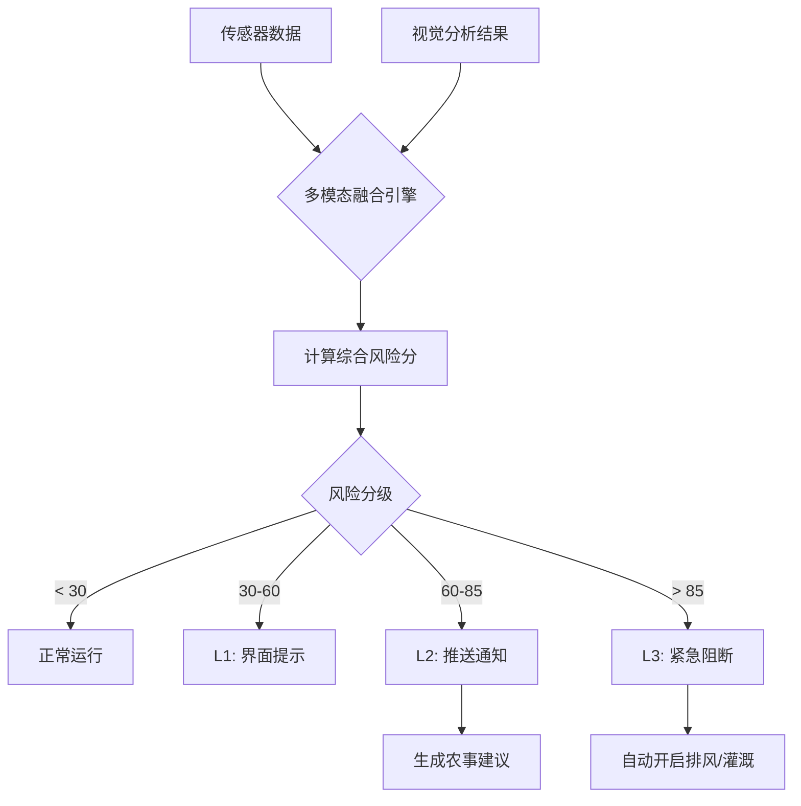

## 5. 智能决策与预警算法 (Intelligent Decision & Alerting)

系统不仅仅是被动监控，还具备主动的风险预警与决策能力。该模块通过**多模态数据融合 (Multi-modal Data Fusion)** 技术，结合环境参数与视觉诊断结果，实现精准告警。

### 5.1 预警算法模型

告警系统采用 **加权风险评估模型 (Weighted Risk Assessment Model)**，计算公式如下：

$$ RiskScore = w_1 \cdot S_{env} + w_2 \cdot S_{visual} + w_3 \cdot S_{trend} $$

*   $S_{env}$ (环境压力指数): 基于 VPD (Vapor Pressure Deficit)、温度、光照的适宜度曲线计算。
*   $S_{visual}$ (视觉异常指数): 来自 VLM 的健康评分 (100 - HealthScore) 或 YOLO 的病害检出置信度。
*   $S_{trend}$ (趋势恶化指数): 基于时间序列预测未来 2 小时的环境恶化概率。

### 5.2 告警分级策略

| 告警等级 | 触发条件 | 响应动作 | 示例场景 |
| :--- | :--- | :--- | :--- |
| **L1 (提示)** | RiskScore > 30 | 记录日志，UI 高亮 | 温度略微偏离，叶片轻微发黄 |
| **L2 (警告)** | RiskScore > 60 | 推送 APP 通知，建议操作 | 湿度持续过高，检测到早期白粉病 |
| **L3 (紧急)** | RiskScore > 85 | 短信/电话通知，**自动控制介入** | 极端高温，检测到大面积腐烂 |

### 5.3 告警流程图

## 6. 创新点总结

1.  **定性与定量结合**: 既有大模型的自然语言描述（定性），又有 0-100 的健康评分和区域热力图（定量），便于数字化管理。
2.  **空间感知能力**: 通过 Prompt 引导模型对画面进行区域分割评分，实现了细粒度的空间健康分布监控。
3.  **多模态融合预警**: 打破了单一传感器告警的局限，利用视觉数据验证环境异常，极大降低了误报率。
4.  **兼容性设计**: 推理服务支持 WebSocket 标准协议，大模型接口兼容 OpenAI/DashScope 规范，易于扩展和替换模型。